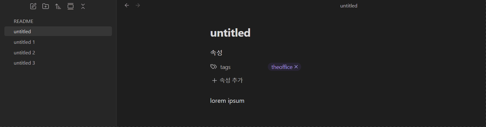

# TagTracker

Embed all notes with a selected tag into a single note.

## Features
- Automatically finds all notes containing a specific tag
- Embeds them as `![[note]]` links into a generated note
- Supports:
  - Sorting by created date, modified date, or title
  - Ignoring notes in specific folders
  - Customizable output note title format (e.g., `${tag} tagged notes`)
- Keeps the output note updated when new tagged notes are created
## How It Works
1. Open the command palette and run **"Generate note with embedded tagged notes"**.
2. Select a tag from the list.
3. A new note will be created (or updated) that embeds all notes with that tag.
## Settings
- **Sort method**: Choose how to order the embedded notes.
- **Excluded folders**: Prevent notes in certain folders from being included.
- **Note title format**: Customize how the title of the generated note looks. Use `${tag}` as a placeholder for the tag name.
## Installation
1. Download `main.js`, `manifest.json`.
2. Place them in a folder named `tagtracker` inside your `.obsidian/plugins/` directory.
3. Restart Obsidian and enable **TagTracker** in the community plugins tab.
## Minimum Obsidian Version
`0.15.0`
## Support & Feedback
Created by [dosakkhayo](https://github.com/dosakkhayo).
Feel free to open issues or pull requests on the GitHub repository.
## License
MIT
